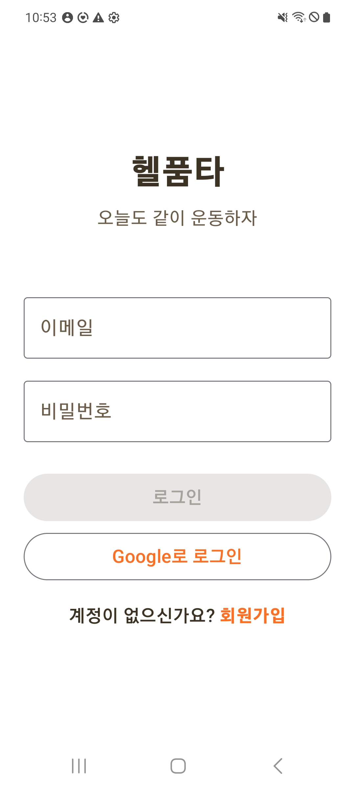
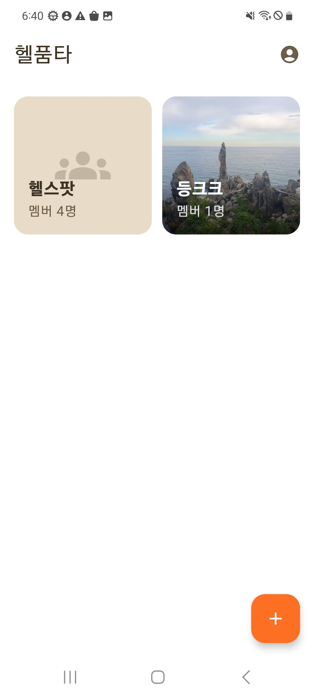
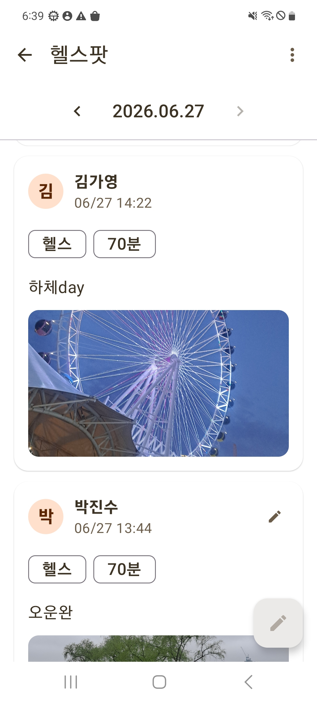
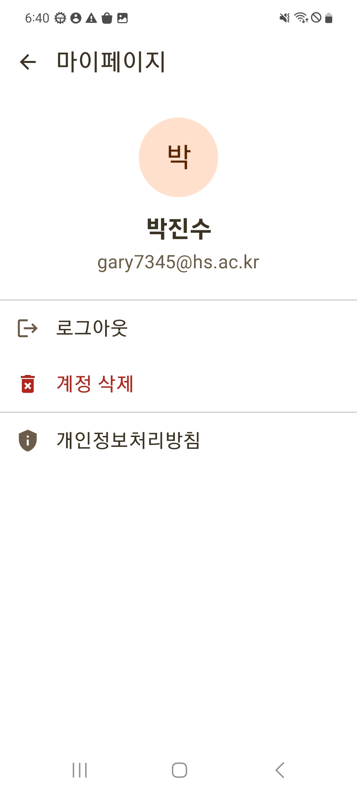
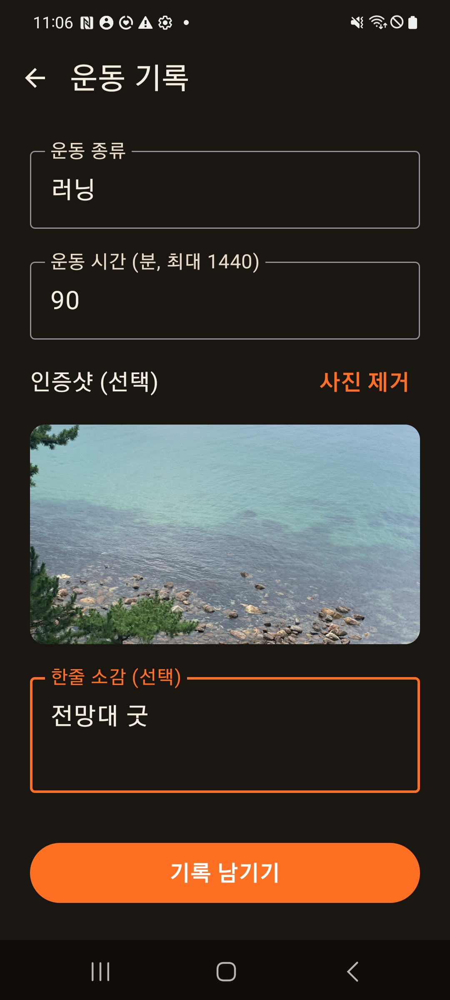
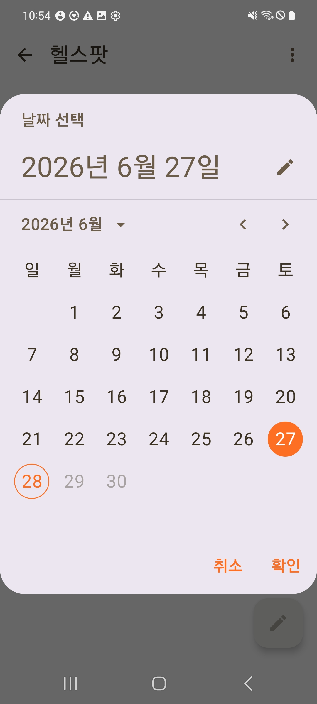
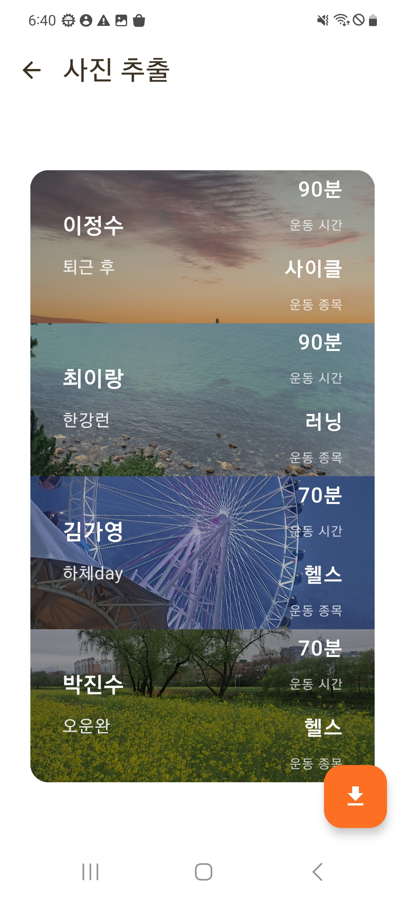
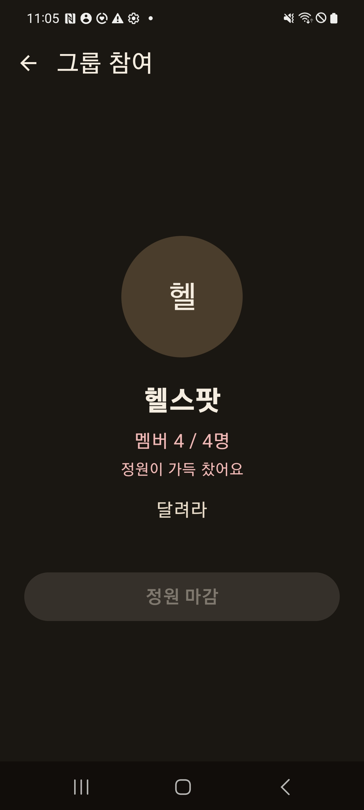

# 💪 헬품타 (Helpumta)

친구들과 그룹을 만들어 운동 기록을 공유하고, 하루의 기록을 한 장의 이미지로 추출하는 Android 운동 기록 앱입니다.

> 열품타(열정을 품은 타이머)의 운동 버전 컨셉으로, 멀리 있는 운동 친구들과 서로 자극받으며 운동 습관을 유지하는 것을 목표로 합니다.

> **본 프로젝트는 Clean Architecture + MVI 패턴의 일관된 적용을 핵심 목표로 한 개인 포트폴리오 프로젝트입니다.**

---

## 🎥 Demo / 📷 Screenshots

|         로그인          |         홈          |        그룹 상세         |        마이페이지         |
|:--------------------:|:------------------:|:--------------------:|:--------------------:|
|   |  |  |  |
|    운동 기록 작성(dark)    |       날짜별 조회       |        사진 추출         |     그룹 참여(dark)      |
|  |  |   |    |

---

## 📌 Overview

친구 그룹 단위로 운동 기록을 공유하는 앱입니다. 그룹원이 각자 운동을 인증하면, 하루치 기록을 모아 **분할 화면 이미지로 추출**할 수 있습니다. (셋로그(Setlog) 스타일)

핵심 사용 흐름:

- 그룹 생성 / 초대 링크(딥링크)로 참여 (최대 4명)
- 운동 종목 · 시간 · 인증샷 · 한줄 소감 기록 (하루 1회)
- 날짜별로 그룹 기록 조회
- 당일 본인 기록 수정
- 선택한 날짜의 기록을 한 장의 이미지로 추출 (미기록자는 zzz 처리)

---

## 🛠 Tech Stack

| 구분 | 기술 |
|---|---|
| Language | Kotlin |
| UI | Jetpack Compose · Navigation Compose |
| Architecture | Clean Architecture (UI / Domain / Data) · MVI |
| DI | Hilt |
| Async | Coroutines · Flow |
| Backend | Firebase (Auth · Firestore · Storage) |
| Image | Coil |

---

## 🏗 Architecture

본 프로젝트의 핵심. **Clean Architecture 3-레이어 + MVI(Contract 통합) 패턴**을 일관되게 적용하는 것을 목표로 했습니다.

```
UI Layer        ──►  Domain Layer       ──►  Data Layer
(Compose,            (UseCase,                (Repository 구현,
 ViewModel,           Repository 인터페이스,    Firebase, Mapper)
 Contract)            Model · Policy)          
```

### 레이어 원칙

- **Domain은 Android/Firebase 의존성 없음** — 순수 Kotlin으로 비즈니스 로직 유지 (Uri → String 변환 후 전달 등)
- **UI는 Data를 직접 참조하지 않음** — 반드시 UseCase(Domain)를 경유. pass-through 수준의 UseCase라도 이 경계를 위해 유지
- **Mapper는 Data Layer** — `DocumentSnapshot` 의존이라 Domain에 둘 수 없음
- **비즈니스 규칙(정책)은 Domain** — 그룹 인원 제한, 운동 시간 상한 등은 `Policy` 객체로 Domain에 단일 정의

### MVI (Contract 통합 방식)

- 화면별 `XxxContract`에 `UiState` / `Intent` / `SideEffect`를 한 곳에 묶음
- `Screen`은 ViewModel 연결만, `Content`는 순수 UI 렌더링 (Content 분리 패턴 → Preview 용이)
- 상태 변경은 `_uiState.update {}`, 결과 처리는 `fold` / `onSuccess` / `onFailure`
- 일회성 이벤트(네비게이션, 토스트)는 `SideEffect`(SharedFlow)로 분리

---

## 📂 Project Structure

```
com.jinsupark.helpumta/
├── ui/          # Compose 화면, ViewModel, Contract, Navigation
├── domain/      # Model, Policy, Repository 인터페이스, UseCase
├── data/        # Repository 구현, Mapper, 외부 연동(Auth/Storage 등)
└── di/          # Hilt 모듈
```

---

## ⚙️ Key Features

### 🔐 인증
- 이메일 / 구글 로그인 (Credential Manager)
- SplashScreen API 기반 자동 로그인
- 계정 삭제 (재인증 + 연관 데이터 정리)
- 로그인/가입 시 `users` 컬렉션 upsert (uid → 닉네임 매핑 보정)
- **에러 메시지 레이어 분리** — Firebase 예외를 도메인 에러 타입으로 분류 후 UI에서 한글화

### 👥 그룹
- 그룹 생성 / 상세 / 나가기
- 딥링크 기반 초대
- **인원 4명 제한** — Firestore 트랜잭션으로 동시 가입 race condition 방어

### 📝 운동 기록
- 운동 종목 · 시간 · 인증샷 · 소감 작성 (하루 1회)
- 날짜별 기록 조회 (Firestore 범위 쿼리)
- **당일 본인 기록 수정** — 작성/수정 화면 통합(AddEdit 패턴), 이미지 교체/제거/유지 처리
- 운동 시간 입력 상한 (도메인 정책 기반)

### 🖼 사진 추출
- 선택한 날짜의 그룹 기록을 분할 이미지로 추출
- 미기록 멤버는 zzz 처리 (`users` 컬렉션으로 미기록자 닉네임 표시)
- 갤러리 저장 (Compose `graphicsLayer` 캡처 + MediaStore) 후 자동 복귀
- 긴 닉네임/소감/종목에 대한 레이아웃 안정화 (우선순위 기반 말줄임)

---

## 💡 Implementation Highlights

> MVI / Clean Architecture 관점 중심으로 정리했습니다.

### 1️⃣ UseCase 기반 멀티 Repository 조율
- 사진 추출은 `records`(기록) + `groups`(멤버 목록) + `users`(닉네임)를 한 UseCase가 조율
- 계정 삭제 / 그룹 나가기처럼 여러 Repository에 걸친 흐름도 UseCase가 단일 진입점으로 묶음
- ViewModel은 Repository를 직접 모름 — 항상 UseCase 경유 (일관성)

### 2️⃣ MVI 단방향 흐름 + 화면 결과 전달
- 상태(UiState) ← Intent → ViewModel → 상태 갱신의 단방향 흐름 유지
- 화면 간 통신은 전역 상태 공유 대신 **Navigation 결과 전달**(savedStateHandle)로 처리

### 3️⃣ 작성/수정 화면 통합 (AddEdit 패턴)
- `recordId`의 유무로 작성/수정 모드를 구분하는 단일 화면 (현업 표준)
- 수정 진입 시 ID만 넘기고 화면이 재조회 (단일 진실 공급원, Navigation은 원시값만 전달)

### 4️⃣ 에러 처리의 레이어 분리
- Firebase 예외를 화면에 그대로 노출하지 않고, 레이어별 책임으로 분리:
    - **Data**: Firebase 예외 → 도메인 에러 타입(`AuthError`)으로 분류 (Firebase를 아는 유일한 레이어)
    - **Domain**: 에러 타입 정의만 (Firebase·문구 모두 모름)
    - **UI**: 에러 타입 → 한글 문구로 변환 (확장 함수로 도메인 타입 비침투)
- 자주 마주치고 케이스 구분이 필요한 인증 에러는 타입 매핑, 드물게 발생하는 Firestore 에러는 한글 고정 메시지로 차등 처리 (오버스펙 회피)

---

## 🔧 Troubleshooting & Trade-offs

본 프로젝트는 "현업 수준의 기준"과 "프로젝트 규모에 맞는 실용성" 사이의 트레이드오프 판단을 중요하게 다뤘습니다. 아래는 실제로 마주친 문제와 판단 과정입니다.

### 1️⃣ Navigation 재진입 시 상태 리셋 버그 (MVI · Navigation)

**문제**: 날짜를 과거로 선택한 뒤 사진 추출 화면에 갔다가 뒤로 오면, 날짜가 오늘로 리셋됨.

**원인**: Navigation Compose는 다른 화면으로 이동 시 이전 화면의 컴포지션을 dispose하고, 복귀 시 재생성한다. 이때 `LaunchedEffect(groupId)`가 다시 실행되며 데이터를 오늘 기준으로 재로딩 → ViewModel의 상태는 살아있었지만 화면 진입 로직이 덮어쓰고 있었음.

**해결**: "단순 재진입"과 "기록 작성 완료"를 구분.
- 재진입 → ViewModel이 같은 그룹이면 로딩 skip (상태 유지)
- 작성 완료 → `savedStateHandle`로 결과 신호를 이전 화면에 전달, 신호가 있을 때만 새로고침

기존에는 "화면에 보일 때마다 무조건 새로고침"이라는 편법을 쓰고 있었고, 이를 **Navigation 결과 전달(startActivityForResult → Fragment Result API → savedStateHandle로 이어지는 표준 패턴)**으로 교체해 해결.

**교훈**: "언제 새로고침해야 하는가"를 이벤트로 명확히 정의하면, 불필요한 갱신과 상태 유실을 동시에 막을 수 있다.

### 2️⃣ 화면 간 데이터 전달 방식 (Navigation)

수정 화면에 기존 기록을 넘길 때, **객체를 통째로 넘기지 않고 `recordId`(String)만 전달**하고 화면이 직접 재조회하도록 했다.

- Navigation은 원시 타입 인자가 안전 (객체 직렬화 회피)
- 항상 최신 데이터 보장 (단일 진실 공급원)
- 메모리에 든 리스트 재활용은 유혹적이지만 화면 간 결합도를 높임

### 3️⃣ 권한 체크의 이중화 (UI + 데이터)

"본인 기록만 수정", "그룹 4명 제한" 같은 규칙은 **UI와 데이터 양쪽**에서 처리.

- **UI**: 수정 버튼을 본인 기록에만 노출 (사용자 편의)
- **데이터**: 실제 수정/가입 시 서버 단에서 재검증 (실제 방어)

UI 차단만으로는 우회 가능하므로, 불변식(인원 제한 등)이 걸린 작업은 Firestore 트랜잭션으로 최종 방어.

### 4️⃣ 오버스펙 회피 — "막아야 할 불변식이 있는가"

추상화/방어 코드의 도입 기준을 **성능이 아니라 "지켜야 할 불변식의 유무"**로 잡음.

- 그룹 4명 제한처럼 **불변식이 있으면** 트랜잭션이 정당화됨
- 단순 조회처럼 불변식이 없으면 트랜잭션은 오버스펙
- DTO 분리, TimeProvider 추상화 등은 프로젝트 규모 대비 과하다고 판단해 미적용
- 반면 pass-through UseCase는 레이어 일관성을 위해 유지 (일관성 > 코드 절약)

### 5️⃣ 플랫폼 I/O와 도메인 경계

갤러리 저장(MediaStore), 외부 링크 열기처럼 **순수 기기 기능**은 도메인(UseCase/Repository) 밖에서 처리.

- 기준: "데이터/비즈니스 로직인가, 기기 I/O·플랫폼 네비게이션인가"
- 갤러리 저장은 후자 → `data/util`의 `ImageSaver`로 분리, UseCase를 거치지 않음
- 개인정보처리방침 링크(브라우저 열기)도 같은 맥락 — UI에서 직접 처리하되 `Content`는 콜백만 받아 순수성 유지

### 6️⃣ 이미지 수정의 3-상태를 단일 필드로 처리

기록 수정 시 이미지는 (유지 / 교체 / 제거) 3가지 경우가 있는데, 별도 플래그 없이 **`imageUri` 문자열의 형태**로 구분.

- `https://...` (기존 URL) → 유지
- `content://...` (새로 선택) → 기존 삭제 + 새 업로드
- `null` (제거) → 기존 삭제

상태를 늘리지 않고 기존 데이터의 자연스러운 형태로 분기한 사례.

### 7️⃣ 비즈니스 규칙의 도메인 분리 (Policy)

"그룹 최대 4명", "운동 시간 최대 1440분" 같은 비즈니스 규칙(상수)은 ViewModel에 하드코딩하지 않고 **Domain의 `Policy` 객체**(`GroupPolicy`, `WorkoutPolicy`)에 단일 정의.

- **값(규칙)은 Domain** — 여러 레이어가 공유하는 단일 진실
- **검증 로직은 상황에 맞는 레이어** — 동시성 불변식인 인원 제한은 데이터(트랜잭션)에서, 단순 입력 제한인 시간 상한은 UI(입력 단계)에서
- 같은 "규칙"이라도 불변식 성격(동시성 유무)에 따라 검증 위치를 달리하는 트레이드오프 판단

### 8️⃣ 텍스트 오버플로우 — 우선순위 기반 레이아웃

추출 이미지는 캡처 결과물이라 텍스트가 넘치면 그대로 깨진다. 좌우 정보가 충돌할 때 **무엇을 살리고 무엇을 줄일지 우선순위**를 정해 처리.

- 추출 슬롯: 운동 시간/종목(우측)을 우선 보존, 닉네임/소감(좌측)을 `weight` + 말줄임으로 양보
- 시간 입력은 4자리(분)부터 칩이 깨져 도메인 정책(1440)으로 입력 자체를 제한
- 가입 화면처럼 정보 전체를 봐야 하는 곳은 의도적으로 말줄임 미적용

### 9️⃣ 캡처 이미지의 포맷 선택 (JPEG vs PNG)

추출 이미지는 검은 배경으로 꽉 차 투명 영역이 없으므로 **JPEG로 충분**하다고 판단. (PNG는 투명도를 지원하지만 용량이 큼) 둥근 모서리가 저장 시 각지게 나오는 것은 JPEG가 투명 영역을 채운 정상 동작이며, 공유용 이미지로는 오히려 자연스러움.

### 🔟 패키지명/applicationId 변경 (출시 · 빌드)

`com.example`은 Play Store가 거부하므로 `com.jinsupark.helpumta`로 변경. applicationId는 **출시 후 변경 불가**라 신중히 결정.

- applicationId / namespace / 패키지 폴더는 별개 개념이나, 일관성을 위해 전부 변경 (Git을 롤백 안전망으로)
- 변경 후 Firebase 앱 재등록 + SHA-1 재등록 + `google-services.json` 교체 (데이터는 프로젝트 단위라 유지)
- 대규모 리네임 후 Hilt가 옛 generated 클래스를 참조하는 컴파일 오류 → `./gradlew clean`으로 빌드 산출물 정리하여 해결

---

## 🔒 보안 / 데이터 정책

- **Firestore 보안 규칙** — 읽기는 인증 기준, 쓰기는 본인만 (조작 방지). 인원 제한 등 불변식은 트랜잭션으로 방어
- **계정 삭제** — 앱 내 삭제(재인증 + 연관 데이터 정리) + 웹 안내 페이지(앱 미설치자용) 이중 경로
- **개인정보처리방침** — 웹 호스팅 후 앱/스토어에서 링크 제공

---

## 🚧 Roadmap (출시 준비)

- [x] 그룹 인원 제한 (4명)
- [x] applicationId 변경 (`com.example` → `com.jinsupark.helpumta`)
- [x] Firebase 재등록 + SHA-1 재등록
- [x] 기록 수정 기능
- [x] Firestore 보안 규칙 강화
- [x] 웹 계정 삭제 경로 + 개인정보처리방침
- [x] 에러 메시지 한글화 (레이어 분리)
- [x] 텍스트 오버플로우 / 입력 상한 처리
- [x] 디자인 정리 (다크모드 · 스플래시 · 카드 · 추출 화면)
- [x] 스토어 등록용 아이콘 (512×512)
- [ ] Play Console 등록 / 비공개 테스트
- [ ] App Links 업그레이드 (초대 링크 외부 공유)
- [ ] Storage 업로드 제한 + App Check (비용/악용 방어)
- [ ] 멀티모듈 + 테스트 코드 (학습 단계)